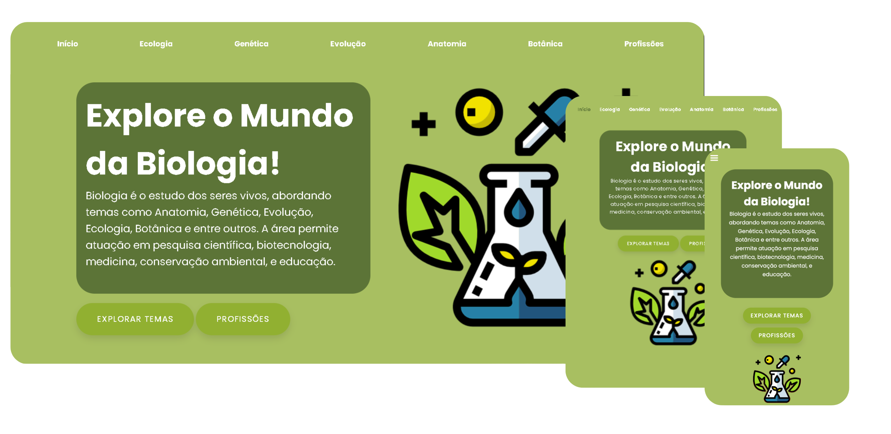

# Website de Biologia

## Prévia do Site

**Tela Principal - Desktop, Tablet e Mobile:**


## Visão Geral
Este projeto é um website informativo e responsivo voltado para o estudo da Biologia no 2º ano do Ensino Médio, com foco em conteúdos educacionais e nas profissões relacionadas à área. Além disso, o site faz uma conexão entre Biologia e Desenvolvimento de Sistemas, destacando o papel da tecnologia no avanço das ciências biológicas.

---

## Funcionalidades Principais

### Conteúdos de Biologia
- Resumo dos principais tópicos abordados no 2º ano do Ensino Médio:
  - **Ecologia:** Conceitos básicos, cadeias alimentares e sustentabilidade.
  - **Genética:** DNA, hereditariedade e biotecnologia.
  - **Evolução:** Origem das espécies e seleção natural.
  - **Anatomia:** Estrutura e funcionamento dos sistemas do corpo humano.
  - **Botânica:** Estudo das plantas e sua importância ecológica.

### Profissões Relacionadas
- Página dedicada às carreiras na área de Biologia e Desenvolvimento de Sistemas, com descrições de profissões como:
  - **Ecólogo:** Especialista em ecossistemas e conservação ambiental.
  - **Geneticista:** Estudo de genes, hereditariedade e manipulação genética.
  - **Microbiólogo:** Pesquisa de microorganismos e suas aplicações.
  - **Biólogo de Sistemas:** Integração de dados biológicos com tecnologias computacionais.
  - **Bioinformata:** Desenvolvimento de ferramentas e análises computacionais para dados biológicos.
  - **Biotecnólogo:** Uso de organismos para criar produtos e processos tecnológicos.

### Responsividade e Navegação
- Design responsivo, compatível com dispositivos móveis e desktops.
- Navegação simples e intuitiva, com um menu acessível e seções bem definidas.

### Menu Responsivo com JavaScript
- Um menu dinâmico e responsivo foi implementado utilizando JavaScript, garantindo uma experiência amigável para usuários em dispositivos tablets.

---

## Tecnologias Utilizadas
- **HTML5:** Estruturação do conteúdo.
- **CSS3:** Estilização e design responsivo.
- **JavaScript:** Funcionalidades interativas, como o menu responsivo.
---

## Estrutura do Projeto

### Páginas do Site
1. **Home:**
   - Apresentação do objetivo do site.
   - Links para as seções principais.

2. **Conteúdo de Biologia:**
   - Resumos e explicações ilustradas sobre os temas do 2º ano.

3. **Profissões:**
   - Lista de carreiras e suas descrições, destacando habilidades e oportunidades.

---

## Instalação e Uso
1. Clone o repositório para o seu ambiente local:
   ```bash
   git clone https://github.com/seu-usuario/repo-biologia.git
   ```

2. Abra o arquivo `index.html` em qualquer navegador moderno para visualizar o site.

---

## Licença
Este projeto está licenciado sob a [MIT License](LICENSE).

---

## Autores
- Giovanna Xavier - Desenvolvedora e estudante de Desenvolvimento de Sistemas no [Senai Jandira](https://sp.senai.br/unidade/jandira/). Conecte-se no [LinkedIn](https://www.linkedin.com/in/giovanna-xavier-978538241/).

- Gabriel Soares - Desenvolvedor e estudante de Desenvolvimento de Sistemas no [Senai Jandira](https://sp.senai.br/unidade/jandira/). Conecte-se no [LinkedIn](https://www.linkedin.com/in/gabriel-soares-3098782b0/).
